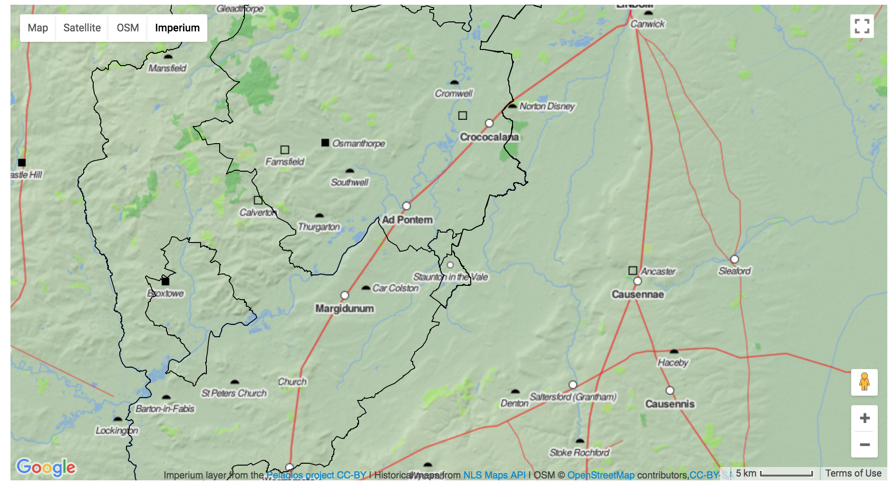

# GeoJSON administrative boundary line dataset

This repository contains the full hierarchy of local government administrative and electoral boundaries in
Great Britain in GeoJSON format. 

It is used within instances of the
[finds.org.uk](https://github.com/findsorguk/findsorguk) database software to provide data for mapping on either Leaflet or Google maps. An example of a map is given below. This uses the [Pelagios](http://commons.pelagios.org/) map tiles from [Johan Åhlfeldt](http://pelagios.org/maps/greco-roman/) (Lund University, Sweden) for displaying data from the Roman period (seriously impressive work.) 



## Requirements

1. Around 5 GB of disk space
2. GDAL 
3. R stats
4. Access to terminal/powershell etc
4. Patience, lots of it.

## Provenance

The data is sourced from the
[Boundary-Line](https://www.ordnancesurvey.co.uk/business-and-government/products/boundary-line.html)
dataset provided by the [Ordnance Survey](https://www.ordnancesurvey.co.uk/). You can also grab this from various mirror stores too eg [MySociety](http://parlvid.mysociety.org/os/)

## Processing these data

The [scripts](scripts) directory contains the original scripts used to convert the data. There are 3 steps to this project:

1. Get the OS data set and unzip to folder,
2. Split each shape file into separate (ID numbered) shape files. (R stats script and ogr2ogr). This takes around one day on a 16GB Macbook Pro 2014 edition.
3. Convert these files into geoJSON for use in the @findsorguk project or elsewhere. (Done at the same time as the split.)

So to run this, use something like R studio and run the splitAndConvert.R script. This outputs data messages like the below:

````
[1] "Split up: ogr2ogr -where 'UNIT_ID = 42709' /Users/danielpett/Documents/research/osData/splitOSdata /Users/danielpett/Documents/research/osData/bdline_gb-2017-10/Data/GB/
county_electoral_division_region.dbf -nln 42709"
````

````
[1] "Convert up: ogr2ogr -f GeoJSON -t_srs WGS84 '/Users/danielpett/Documents/research/osData/geoJSON/42709.geojson' '/Users/danielpett/Documents/research/osData/splitOSdata/42709.shp' -skipfailures"
````

If you need it, a renaming python file is also included.

## Copyright and Licensing

The original data was released under the [Open Government Licence](http://www.nationalarchives.gov.uk/doc/open-government-licence/version/3/).
Contains Ordnance Survey data © Crown copyright and database right 2016. 

The script is released under an MIT license. 

Release 1.0 (2015 boundaries)
[](https://zenodo.org/badge/latestdoi/29851906)
Release 2.0 (October 2010 boundaries)

